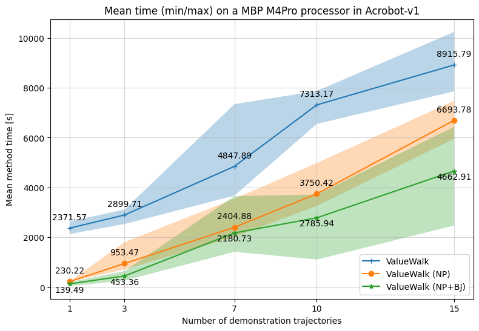

> **WARNING: This code is still experimental, and some features or functionalities may be changed or unavailable. Please proceed with caution when using this code to run your experiments. If you need to run ValueWalk for a simple environment and do not care about inference time, prefer using the algorithms in the main branch of this repository.**

This repository branch contains the JAX-based implementation of the ValueWalk algorithm, originally presented in "Walking the Values in Bayesian Inverse Reinforcement Learning" by Ondrej Bajgar et al. (UAI 2024).
The article is available here: https://arxiv.org/abs/2407.10971

## ValueWalk in Numpyro and (Black)JAX

This repository branch implements the ValueWalk algorithm, originally implemented using Pyro and Torch back-end, in JAX to benefit from computational speedups offered by JAX. To do so, we choose Numpyro as the PPL, and JAX as the back-end. Furthermore, we implement a version that uses samplers provided by Blackjax, offering additional computational speedups.

This implementation is experimental, and is meant as a feasibility study. We only implemented the continuous version of ValueWalk, and our Numpyro implementaiton is minimal, only swapping out parts of the code that are part of the Bayesian inference path. As such, costly conversions from JAX to Torch and back happen at multiple points in the codebase, leaving further performance gains on the table.

We test the implementations on the Acrobot environment, where we get an average speed-up of 1.5-10x (Max: 11x / Min: 1.1x) for the Numpyro-JAX implementation, and an average speed-up of 2-23x (Max: 45x / Min: 1.4) for the Blackjax implementation. You can also see the mean (min/max) runtimes in the plot below. These speedups allow us, for example, to solve Acrobot with a single demonstration in less than 1 minute.



All other verification and results can be seen in `experiments/birl/notebooks/03_acrobot_new_algos.ipynb`.

## Installation
To install the depenencies of this repository, run:
```
uv sync
```
and let UV do the magic of setup.

This repository's Python version is pinned to 3.13. We can confirm that the original implementation of ValueWalk runs on Acrobot in this version. Other environments were not tested.

### 2. Running Acrobot Experiments
The experiment files can be found in the `experiments/birl` folder.

To run experiments on Acrobot, run the following two scripts: `06b2_vw_acrobot.py`, and `06b2_vw_npy_acrobot.py`. By running each of these scripts, you will run an experiment loop with [1, 3, 7, 10, 15] trajectories and [0, 1, 2, 3, 4] splits. In `06b2_vw_npy_acrobot.py`, set `BLACKJAX=False` if you want to run the pure Numpyro-JAX implementation, or set it to `True` to run the Blackjax implementation.

Once you've ran the experiment loops, simply run all cells in `experiments/birl/notebooks/03_acrobot_new_algos.ipynb` to reproduce the validation and timing plots for your machine.

## Contributing

If you wish to contribute to this repository, simply create a fork, implement changes, and open a PR. Feel free to also get in touch with either Ondrej or Peter. Help is appreciated, especially if you have ideas on how to further speed up the algorithms, or make them more computationally efficient.